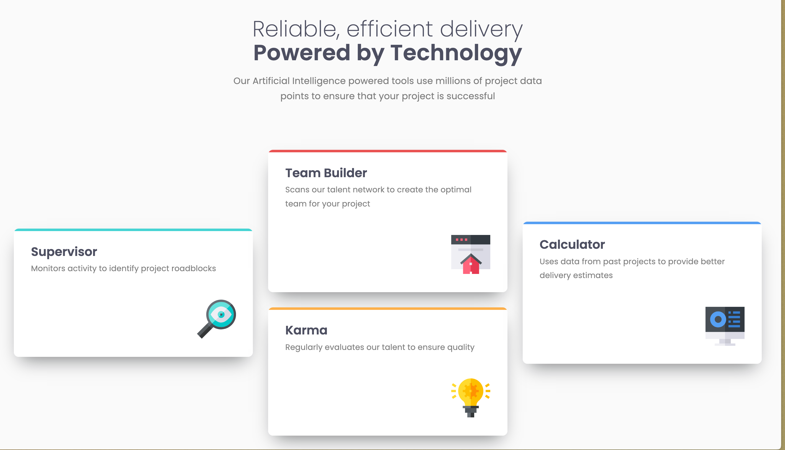
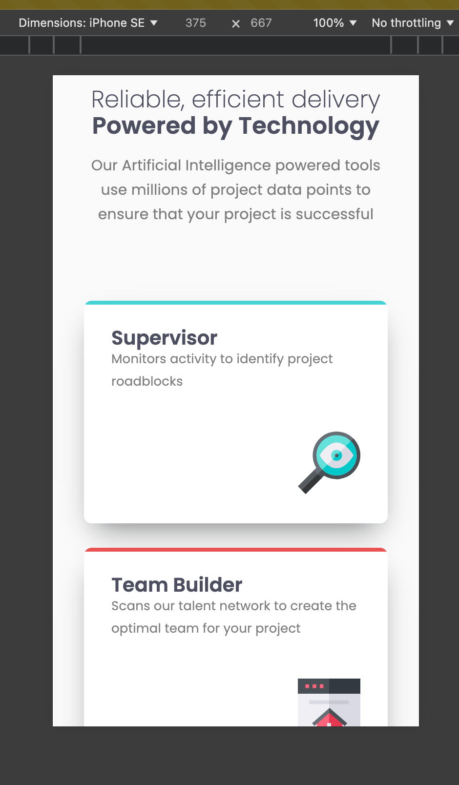

# Frontend Mentor - Product preview card component solution

This is a solution to the [Product preview card component challenge on Frontend Mentor](https://www.frontendmentor.io/challenges/product-preview-card-component-GO7UmttRfa). Frontend Mentor challenges help you improve your coding skills by building realistic projects.

## Table of contents

- [Overview](#overview)
  - [The challenge](#the-challenge)
  - [Screenshot](#screenshot)
  - [Links](#links)
- [My process](#my-process)
  - [Built with](#built-with)
  - [What I learned](#what-i-learned)
  - [Continued development](#continued-development)
  - [Useful resources](#useful-resources)
- [Author](#author)
- [Project setup](#project-setup)

**Note: Delete this note and update the table of contents based on what sections you keep.**

## Overview

### The challenge

Users should be able to:

- View the optimal layout depending on their device's screen size
- See hover and focus states for interactive elements

### Screenshot

#### Desktop screenshot



#### Mobile screenshot



### Links

- Solution URL: [here]()
- Live Site URL: [here](https://jameslaviron.github.io/four-card-feature-section/)

## My process

### Built with

- Semantic HTML5 markup
- SASS
- BEM methodology
- CSS custom properties
- Flexbox
- CSS Grid
- CSS mixins
- [Vue](https://vuejs.org/) - JS library
- Logical properties
- Responsive IMG
- Reset file

### What I learned

I learned how to work easily with grids and flex boxes. It seems now more familiar to me. However I still don't think I did the best integration ever as soon as I use 2 media queries in order to handle it.

### Continued development

I want to continue focusing on flex boxes and grids. I still need to figure out how to make it as simple as possible while keeping it responsive.

### Useful resources

- [BEM cheat sheet](https://bem-cheat-sheet.9elements.com/) - This helped me to understand BEM methodology.
- [BEM article](https://sparkbox.com/foundry/bem_by_example) - Nice article usefull to understand BEM.

### Author

- Frontend Mentor - [@JamesLaviron](https://www.frontendmentor.io/profile/JamesLaviron)

### Project setup

```sh
yarn install
```

#### Compiles and hot-reloads for development

```sh
yarn serve
```

#### Compiles and minifies for production

```sh
yarn build
```

#### Lints and fixes files

```sh
yarn lint
```

#### Customize configuration

See [Configuration Reference](https://cli.vuejs.org/config/).
